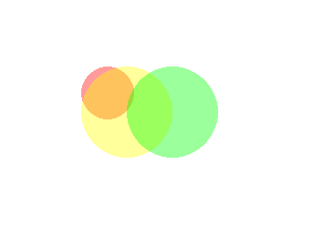
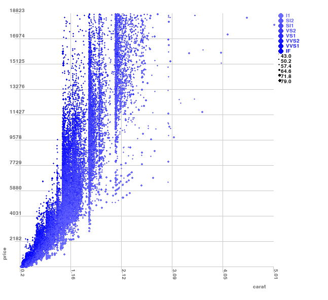

See a snake game by [TheBigKahuna353](https://github.com/TheBigKahuna353)

```python
import hooman
import random
import pygame

WIDTH, HEIGHT = 600, 600

hapi = hooman.Hooman(WIDTH, HEIGHT)

btn_style = {'outline': True,
             'background_color': (255, 0, 0),
             'curve': 0.7,
             'outline_thickness': 3}

slider_style = {'background_color': (200, 200, 200),
                'slider_height': 60,
                'slider_color': (240, 240, 240)
                }

class Game:
    def __init__(self):
        self.current_screen = self.Main_menu
        hapi.handle_events = self.Events

        self.menu_btn_start = hapi.button(200, 200, 200, 50, "Start", btn_style)
        self.menu_btn_quit = hapi.button(200, 400, 200, 50, "Quit", btn_style)
        self.settings_btn = hapi.button(200, 300, 200, 50, 'Settings', btn_style)

        slider_style.update({'value_range': [5, 30],
                                 'step': 1,
                                 'starting_value': 20})
        self.rows_slider = hapi.slider(300, 200, 200, 30, slider_style)
        self.rows_slider = hapi.slider_with_text(self.rows_slider)
        
        slider_style.update({'value_range': [0.01, 1],
                             'step': 0,
                             'starting_value': 0.1})
        self.speed_slider = hapi.slider(300, 300, 200, 30, slider_style)
        self.speed_slider = hapi.slider_with_text(self.speed_slider, {'accuracy': 2})
        self.slider_names = ['num of rows', 'speed']
        self.back_btn = hapi.button(200, 400, 200, 50, "Back", btn_style)

        self.size = WIDTH//self.rows_slider.value()

        self.start_pos = 5, 5
        self.head = [x * self.size for x in self.start_pos]
        self.body = []
        self.food_pos = [random.randint(0, WIDTH) // self.size * self.size for x in range(2)]
        self.direction = [0, 0]
        self.move = hapi.timer(seconds=self.speed_slider.value())

    def Start(self):
        while hapi.is_running:
            self.current_screen()

            hapi.flip_display()
            hapi.event_loop()

    def Main(self):
        hapi.background(hapi.color['black'])
        hapi.fill(hapi.color['yellow'])
        hapi.rect(self.head[0]+1, self.head[1]+1, self.size-2, self.size-2)
        for x, y in self.body:
            hapi.rect(x+1, y+1, self.size-2, self.size-2)
        if self.move:
            for i in range(len(self.body) -1, 0, -1):
                self.body[i] = self.body[i - 1]
            if len(self.body) > 0:
                self.body[0] = self.head            
            self.head = [self.head[i] + self.direction[i] for i in range(2)]
            self.move = hapi.timer(seconds=self.speed_slider.value())
            if self.head in self.body:
                self.Died()
            elif self.head[0] >= WIDTH or self.head[0] < 0 or self.head[1] < 0 or self.head[1] >= HEIGHT:
                self.Died()            
            if self.head == self.food_pos:
                self.body.append(self.head[:])
                self.food_pos = [random.randint(0, WIDTH) // self.size * self.size for x in range(2)]
        hapi.fill(hapi.color['green'])
        hapi.rect(self.food_pos[0], self.food_pos[1], self.size-1, self.size-1)

    def Died(self):
        self.head = [x * self.size for x in self.start_pos]
        self.body = []
        self.food_pos = [random.randint(0, WIDTH) // self.size * self.size for x in range(2)]
        self.direction = [0, 0]
        self.current_screen = self.Main_menu

    def Settings(self):
        hapi.background(hapi.color['white'])
        self.speed_slider.update()
        self.rows_slider.update()
        hapi.fill(hapi.color['black'])
        hapi.font_size(30)
        hapi.text(self.slider_names[0], 100, 200)
        hapi.text(self.slider_names[1], 100, 300)
        if self.back_btn.update():
            self.current_screen = self.Main_menu

    def Main_menu(self):
        hapi.background(hapi.color['white'])
        hapi.fill(hapi.color['black'])
        hapi.font_size(50)
        hapi.text("Snake", 220, 30)
        if self.menu_btn_quit.update():
            hapi.is_running = False
        if self.menu_btn_start.update():
            self.current_screen = self.Main
        if self.settings_btn.update():
            self.current_screen = self.Settings

    def Events(self, event):
        if event.type == pygame.QUIT:
            hapi.is_running = False
        elif event.type == pygame.KEYDOWN:
            if event.unicode == "a" or event.key == 276:
                self.direction = [-self.size, 0]
            elif event.unicode == "d" or event.key == 275:
                self.direction = [self.size, 0]
            elif event.unicode == "w" or event.key == 273:
                self.direction = [0, -self.size]
            elif event.unicode == "s" or event.key == 274:
                self.direction = [0, self.size]

if __name__ == '__main__':
    game = Game()
    game.Start()

```

For about the same number of lines for a simple snake game, you get one complete with menus, interfaces and settings:


# tutorials

- [Building A Color Picker](https://dev.to/abdurrahmaanj/building-a-color-picker-in-pygame-using-hooman-307m)
- [Display most frequent words using PyGame](https://www.pythonkitchen.com/display-most-frequent-words-python-pygame/)
- [Realtime CPU monitor using PyGame](https://www.pythonkitchen.com/realtime-cpu-monitor-using-pygame/)

# (new) record video

```python
from hooman import Hooman

import pygame

hapi = Hooman(500, 500)

def handle_events(event):
    if event.type == pygame.QUIT:
        hapi.is_running = False


hapi.handle_events = handle_events

while hapi.is_running:
    hapi.background((255, 255, 255))

    hapi.stroke_size(5)
    hapi.stroke((0, 255, 0))

    for i in range(0, hapi.WIDTH, 20):
        hapi.line(i, 0, hapi.mouseX(), hapi.mouseY())


    hapi.record()
    hapi.flip_display()
    hapi.event_loop()
    

pygame.quit()
hapi.save_record('mov.mp4', framerate=25)
```

# (new) screenshot


```
hapi.save(path)
```

# (new) Integrate with other pygame codes

```python
# from https://pythonguides.com/create-a-game-using-python-pygame/
# Hooman >= 0.8.2

import pygame


from hooman import Hooman # <-- this


black = (0, 0, 0)
white = (255, 255, 255)

red = (255, 0, 0)
WIDTH = 20
HEIGHT = 20
MARGIN = 5
grid = []
for row in range(10):
    grid.append([])
    for column in range(10):
        grid[row].append(0) 
grid[1][5] = 1
pygame.init()
window_size = [255, 255]
scr = pygame.display.set_mode(window_size)
hapi = Hooman(integrate=True, screen=scr) # <-- this
pygame.display.set_caption("Grid")
done = False
clock = pygame.time.Clock()
while not done:
    for event in pygame.event.get(): 
        if event.type == pygame.QUIT: 
            done = True 
        elif event.type == pygame.MOUSEBUTTONDOWN:
            pos = pygame.mouse.get_pos()
            column = pos[0] // (WIDTH + MARGIN)
            row = pos[1] // (HEIGHT + MARGIN)
            grid[row][column] = 1
            print("Click ", pos, "Grid coordinates: ", row, column)
    scr.fill(black)
    for row in range(10):
        for column in range(10):
            color = white
            if grid[row][column] == 1:
                color = red
            pygame.draw.rect(scr,
                             color,
                             [(MARGIN + WIDTH) * column + MARGIN,
                              (MARGIN + HEIGHT) * row + MARGIN,
                              WIDTH,
                              HEIGHT])
    clock.tick(50)
    pygame.display.flip()
    hapi.record() # <-- this
pygame.quit()
hapi.save_record('movie.mp4') # <-- this
```

# (new) save to svg

```python
# https://github.com/mwaskom/seaborn-data/blob/master/penguins.csv

from hooman import Hooman
import pandas as pd
import os

window_width, window_height = 650, 600
hapi = Hooman(window_width, window_height, svg=True)


base_path = os.path.dirname(os.path.abspath(__file__))
df = pd.read_csv(os.path.join(base_path, "data", "penguins.csv"))
df = df.fillna(0)

data = {k:list(df[k]) for k in df.columns.values.tolist()}

hapi.background(255)

colx = "bill_length_mm"
coly = "bill_depth_mm"

hapi.scatterchart(
        40,
        30,
        500,
        500,
        {
        "data": data,
            "ticks_y": 12,
            "ticks_x": 12,
            "range_y": [min(data[coly]), max(data[coly])],
            "range_x": [min(data[colx]), max(data[colx])],
            "show_axes": True,
            "tick_size": 10,
            "show_ticks_x": True,
            "show_ticks_y": True,
            "x": colx,
            "y": coly,
            "plot_background": False,
            "plot_grid": False,
            "line_color": 200,
            "type": "hist",
            "hist_color": "g"
        },
    )

hapi.save_svg(os.path.join(base_path, 'file.svg'))
```

# (new) keyword argument same as dictionary


```python
hapi.scatterchart(
        40,
        30,
        500,
        500,
        {
        "data": data,
            "ticks_x": 5,
            "mouse_line": False,
            "range_y": [min(data[coly]), max(data[coly])],
            "range_x": [min(data[colx]), max(data[colx])],
            "tick_size": 10,
            "show_ticks_x": True,
            "show_ticks_y": True,
            "x": colx,
            "y": coly,
            "hue": "clarity",
            "hue_order": clarity_ranking,
            "size": "depth",
            "plot_background": False,
            "plot_background_grid": True,
            "plot_background_color": (234,234,242),
            "plot_background_grid_color": 200,
            "line_color": 200
        }
    )

# same as

hapi.scatterchart(
        40,
        30,
        500,
        500,
        {
        "data": data,
            "ticks_x": 5,
            "mouse_line": False,
            "range_y": [min(data[coly]), max(data[coly])],
            "range_x": [min(data[colx]), max(data[colx])],
            "tick_size": 10,
            "show_ticks_x": True,
            "show_ticks_y": True,
            "hue": "clarity",
            "hue_order": clarity_ranking,
            "size": "depth",
            "plot_background": False,
            "plot_background_grid": True,
            "plot_background_color": (234,234,242),
            "plot_background_grid_color": 200,
            "line_color": 200
        },
        x=colx,
        y=coly
    )

# i.e you can mix both or use one option over the other

```

# demos


color change

```python
from hooman import Hooman

import pygame

hapi = Hooman(500, 500)

def handle_events(event):
    if event.type == pygame.QUIT:
        hapi.is_running = False

hapi.handle_events = handle_events

while hapi.is_running:
    hapi.background((255, 255, 255))

    hapi.no_stroke()
    mx = (hapi.mouseX() / hapi.WIDTH) * 255

    hapi.fill((0, mx, 0))
    for i in range(50 , 200, 60):
        hapi.rect(i, 50, 30, 30)

    hapi.fill((255, 0, 0))
    hapi.ellipse(hapi.mouseX(), hapi.mouseY(), 10, 10)

    hapi.stroke_size(1)
    hapi.stroke((255, 10, 10))
    hapi.line(0, hapi.mouseY(), hapi.mouseX()-10, hapi.mouseY())

    hapi.flip_display()
    hapi.event_loop()

pygame.quit()

```

lines


```python
from hooman import Hooman

import pygame

hapi = Hooman(500, 500)

def handle_events(event):
    if event.type == pygame.QUIT:
        hapi.is_running = False

hapi.handle_events = handle_events

while hapi.is_running:
    hapi.background((255, 255, 255))

    hapi.stroke_size(5)
    hapi.stroke((0, 255, 0))

    for i in range(0, hapi.WIDTH, 20):
        hapi.line(i, 0, hapi.mouseX(), hapi.mouseY())

    hapi.flip_display()
    hapi.event_loop()

pygame.quit()

```

squares


```python
from hooman import Hooman

import pygame

hapi = Hooman(500, 500)

def handle_events(event):
    if event.type == pygame.QUIT:
        hapi.is_running = False

hapi.handle_events = handle_events

size = 50
while hapi.is_running:
    hapi.background((255, 255, 255))

    hapi.no_stroke()
    hapi.fill((0, 255, 0))
    hapi.rect(10, 10, size, size)
    hapi.fill((255, 255, 0))
    hapi.rect(100, 100, size, size)
    hapi.fill((255, 0, 0))
    hapi.rect(100, 10, size, size)
    hapi.fill((0, 0, 255))
    hapi.rect(10, 100, size, size)

    hapi.flip_display()
    hapi.event_loop()

pygame.quit()

```

buttons


```python
from hooman import Hooman

import pygame

window_width, window_height = 500, 500
hapi = Hooman(window_width, window_height)

bg_col = (255, 255, 255)

# the function that gets called when the button is clicked on
def button_clicked(this):
    if this.y == 250:
        this.y = 300
    else:
        this.y = 250


grey_style = {
    "background_color": (200, 200, 200),
    "hover_background_color": (220, 220, 220),
    "curve": 0.1,
    "padding_x": 5,
    "padding_y": 5,
    "font_size": 15,
}


def button_hover_enter(this):
    hapi.set_background(hapi.color["green"])


def button_hover_exit(this):
    hapi.set_background(hapi.color["white"])


stylex = grey_style.copy()
stylex["on_hover_enter"] = button_hover_enter
stylex["on_hover_exit"] = button_hover_exit

button1 = hapi.button(150, 150, 100, 100, "Click Me", grey_style)

buttonx = hapi.button(150, 10, 100, 100, "Hover Me", stylex)

button2 = hapi.button(
    150,
    250, 100, 100,
    "No Click Me",
    {
        "background_color": (200, 200, 200),
        "hover_background_color": (220, 220, 220),
        "outline": True,
        "outline_color": (200, 200, 200),
        "outline_thickness": 5,
        "curve": 0.3,
        "on_click": button_clicked,
        "padding_x": 40,
        "padding_y": 10,
        "font_size": 15,
    },
)


def handle_events(event):
    if event.type == pygame.QUIT:
        hapi.is_running = False
    if event.type == pygame.KEYDOWN:
        if event.key == pygame.K_ESCAPE:
            hapi.is_running = False


hapi.handle_events = handle_events

clock = pygame.time.Clock()

hapi.set_background(hapi.colour["white"])

while hapi.is_running:

    if button1.update():  # if the button was clicked
        bg_col = (255, 0, 0) if bg_col == (255, 255, 255) else (255, 255, 255)
        hapi.set_background(bg_col)

    # for i in range(5):
    #     x = hapi.button(10+i*80, hapi.mouseY(), "Click Me",
    #         grey_style
    #     )
    # don't use it for ui elements in loop lile the above
    # each element can also be individually
    # updated
    hapi.update_ui()
    hapi.event_loop()

    hapi.flip_display()

    clock.tick(60)

pygame.quit()

```



transparent circles

```python
import pygame
from hooman import Hooman
pygame.init()

hapi = Hooman(800, 600)


while hapi.is_running:
    hapi.background(hapi.color['white'])


    hapi.set_alpha(100)
    hapi.fill(hapi.color['red'])
    hapi.alpha_ellipse(100, 100, hapi.mouseX()//2, hapi.mouseX()//2)
    hapi.fill(hapi.color['yellow'])
    hapi.alpha_ellipse(100, 100, 100, 100)
    hapi.fill(hapi.color['green'])
    hapi.alpha_ellipse(150, 100, 100, 100)
    pygame.display.flip()

    hapi.event_loop()

pygame.quit()
```

supershapes


```python
from hooman import Hooman
import numpy
from math import pow
from math import sqrt
import pygame

window_width, window_height = 500, 500
hapi = Hooman(window_width, window_height)

bg_col = (255, 255, 255)


def handle_events(event):
    if event.type == pygame.QUIT:
        hapi.is_running = False
    if event.type == pygame.KEYDOWN:
        if event.key == pygame.K_ESCAPE:
            hapi.is_running = False


hapi.handle_events = handle_events

clock = pygame.time.Clock()


while hapi.is_running:
    hapi.background(bg_col)

    hapi.fill(hapi.color['red'])

    #hapi.text(n1, 10+hapi.mouseX(), 10+hapi.mouseY())

    hapi.smooth_star(100, 100, 100, 100)
    hapi.oil_drop(100, 250, 100, 100)
    hapi.flowing_star(100, 350, 100, 100)

    hapi.flip_display()
    hapi.event_loop()

pygame.quit()
```

cross hair


```python
from hooman import Hooman
from math import pow
from math import sqrt

window_width, window_height = 500, 500
hapi = Hooman(window_width, window_height)

bg_col = (255, 255, 255)


def handle_events(event):
    if event.type == pygame.QUIT:
        hapi.is_running = False
    if event.type == pygame.KEYDOWN:
        if event.key == pygame.K_ESCAPE:
            hapi.is_running = False

hapi.handle_events = handle_events

while hapi.is_running:
    hapi.background(bg_col)

    hapi.stroke(hapi.color['red'])
    hapi.stroke_size(2)

    mouse_coord = (hapi.mouseX(), hapi.mouseY())
    hapi.cross_hair(mouse_coord)

    hapi.flip_display()
    hapi.event_loop()

pygame.quit()
```

constrain


```python
from hooman import Hooman
import numpy
from math import pow
from math import sqrt
import pygame

window_width, window_height = 500, 500
hapi = Hooman(window_width, window_height)

bg_col = (255, 255, 255)


def handle_events(event):
    if event.type == pygame.QUIT:
        hapi.is_running = False
    if event.type == pygame.KEYDOWN:
        if event.key == pygame.K_ESCAPE:
            hapi.is_running = False


hapi.handle_events = handle_events


def fake_slider(pos, x, y, width):
    size = 10
    hapi.fill(hapi.color['grey'])
    hapi.rect(x, y, width, size)
    hapi.fill((200, 200, 200))
    hapi.rect(pos, y, size, size)

while hapi.is_running:
    hapi.background(bg_col)

    fake_slider(hapi.mouseX(), 0, 450, hapi.WIDTH)

    reflected_val = hapi.constrain(hapi.mouseX(), 0, 500, 0, 255)
    reflected_col = (reflected_val, reflected_val, reflected_val)
    hapi.fill(reflected_col)
    hapi.rect(10, 10, 100, 100)

    reflected_val2 = hapi.constrain(hapi.mouseX(), 0, 500, 100, 200)
    fake_slider(reflected_val2, 100, 200, 100)

    hapi.flip_display()
    hapi.event_loop()

pygame.quit()
```

graphs


```python
from hooman import Hooman
from collections import OrderedDict
import pygame
import random

window_width, window_height = 500, 500
hapi = Hooman(window_width, window_height)

bg_col = (255, 255, 255)


while hapi.is_running:
    hapi.background(bg_col)

    hapi.piechart(100, 100, 50, [
        ['a', 20, hapi.color['red']],
        ['b', 30, hapi.color['blue']],
        ['c', 40, hapi.color['yellow']],
        ['d', 60, hapi.color['green']],
        ['e', 30, hapi.color['black']]
    ], start_rad=20)

    hapi.barchart(
        190, 30, 200, 200, {
        "data": {"a": 10, "b": 20, "c": 90},
        "mouse_line": True
        }
    )

    hapi.linechart(
        30,
        270,
        200,
        100,
        {
            "lines": [
                'label': '---',
                'color': (0, 0, 0),
                "data": [[0, 0], [100, 100], [200, 20], [300, 200]]
            ],
            "mouse_line": True,
            "range_y": [0, 200],
            "range_x": [0, 300],
        },
    )

    hapi.event_loop()
    hapi.flip_display()

pygame.quit()

```

#### scatter plot




```python
# https://seaborn.pydata.org/examples/different_scatter_variables.html

from hooman import Hooman
import pandas as pd
import os

window_width, window_height = 650, 600
hapi = Hooman(window_width, window_height)


base_path = os.path.dirname(os.path.abspath(__file__))
df = pd.read_csv(os.path.join(base_path, "data", "diamonds.csv"))

data = {k:list(df[k]) for k in df.columns.values.tolist()}

hapi.background(255)

colx = 'carat'
coly = 'price'

clarity_ranking = ["I1", "SI2", "SI1", "VS2", "VS1", "VVS2", "VVS1", "IF"]
hapi.scatterchart(
        40,
        30,
        500,
        500,
        {
        "data": data,
            "ticks_y": 8,
            "ticks_x": 5,
            "mouse_line": False,
            "range_y": [min(data[coly]), max(data[coly])],
            "range_x": [min(data[colx]), max(data[colx])],
            "show_axes": True,
            "tick_size": 10,
            "show_ticks_x": True,
            "show_ticks_y": True,
            "x": colx,
            "y": coly,
            "hue": "clarity",
            "hue_order": clarity_ranking,
            "size": "depth",
            "plot_background": False,
            "plot_background_grid": True,
            "plot_background_color": (234,234,242),
            "plot_background_grid_color": 200,
            "line_color": 200
        },
    )

while hapi.is_running:
    bg_col = (255, 255, 255)

    hapi.flip_display()
    hapi.event_loop()
```

#### scatter plot hist


```python
# https://github.com/mwaskom/seaborn-data/blob/master/penguins.csv

from hooman import Hooman
import pandas as pd
import os

window_width, window_height = 650, 600
hapi = Hooman(window_width, window_height)


base_path = os.path.dirname(os.path.abspath(__file__))
df = pd.read_csv(os.path.join(base_path, "data", "penguins.csv"))
df = df.fillna(0)

data = {k:list(df[k]) for k in df.columns.values.tolist()}

hapi.background(255)

colx = "bill_length_mm"
coly = "bill_depth_mm"

hapi.scatterchart(
        40,
        30,
        500,
        500,
        {
        "data": data,
            "ticks_y": 12,
            "ticks_x": 12,
            "range_y": [min(data[coly]), max(data[coly])],
            "range_x": [min(data[colx]), max(data[colx])],
            "show_axes": True,
            "tick_size": 10,
            "show_ticks_x": True,
            "show_ticks_y": True,
            "x": colx,
            "y": coly,
            "plot_background": False,
            "plot_grid": False,
            "line_color": 200,
            "type": "hist",
            "hist_color": "b"
        },
    )

while hapi.is_running:
    bg_col = (255, 255, 255)

    hapi.flip_display()
    hapi.event_loop()
```
