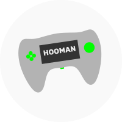
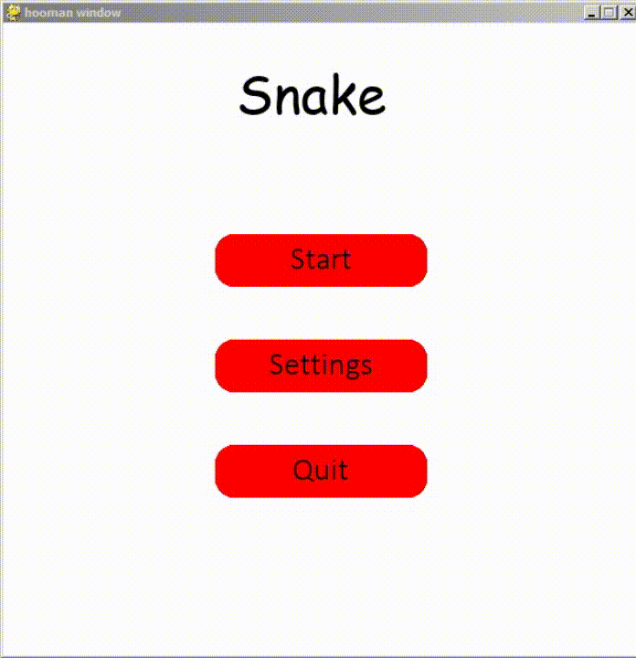
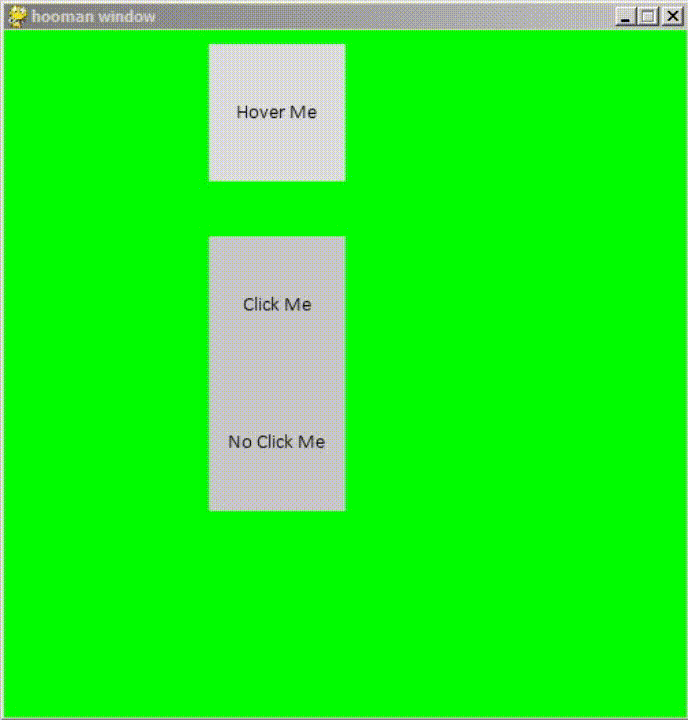
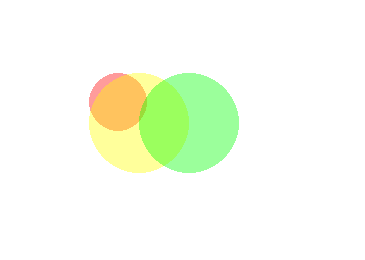
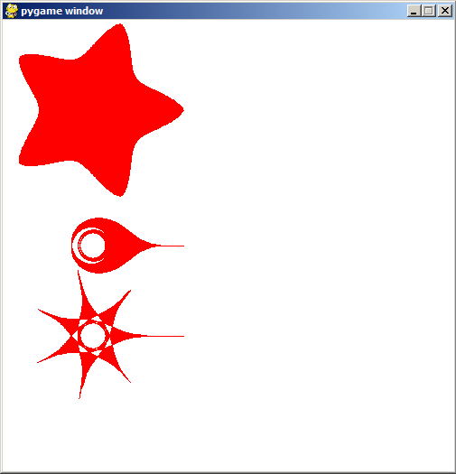
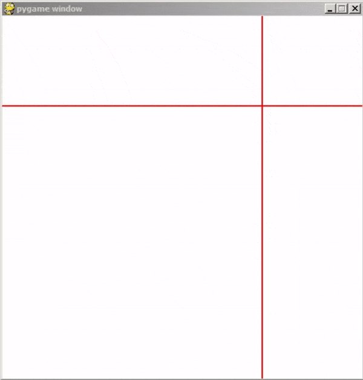
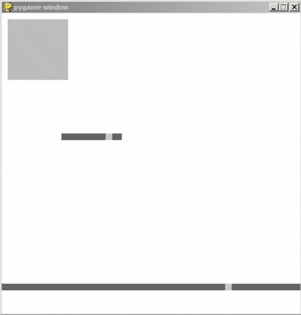
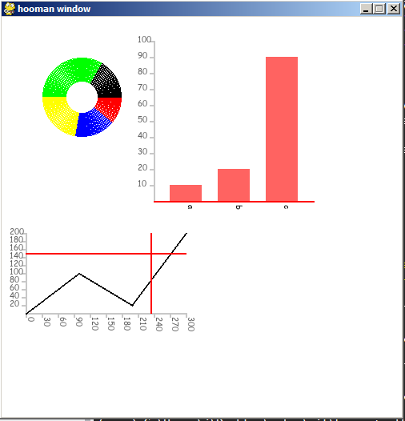
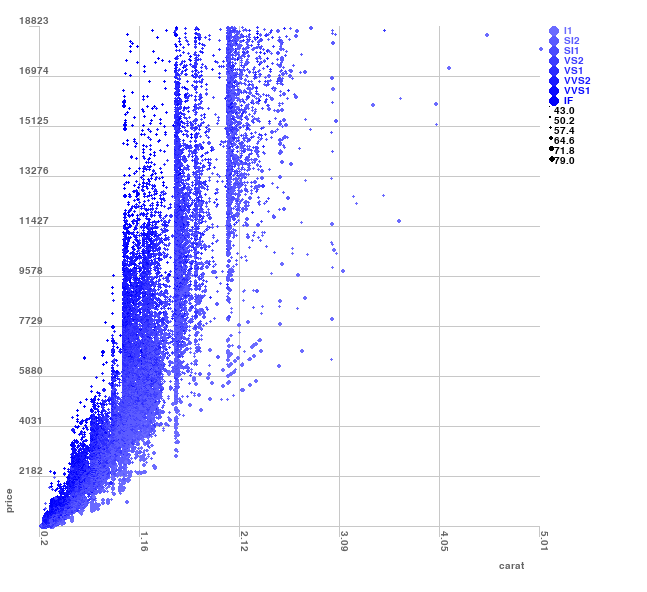
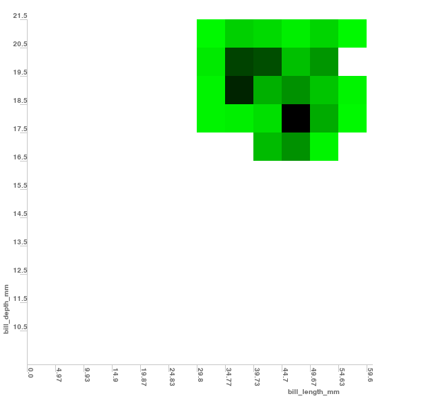

<p align="center">
  <br>
  <a href="https://github.com/Abdur-rahmaanJ/hooman"></a>
  <br>
</p>


# hooman [](https://pepy.tech/project/hooman) 

~ pygame for humans

```
pip install hooman
```

join discord: https://discord.gg/Q23ATve

The package for clearer, shorter and cleaner PyGame codebases!

Fun fact: Codementor.io [tweeted about Hooman](https://twitter.com/CodementorIO/status/1306295790441246725?s=20) tagged #LearnPython #100DaysOfCode

NEW: save to svg now supported

# hooman is powerful!

See a snake game by [TheBigKahuna353](https://github.com/TheBigKahuna353)

```python
import hooman
import random
import pygame

WIDTH, HEIGHT = 600, 600

hapi = hooman.Hooman(WIDTH, HEIGHT)

btn_style = {'outline': True,
             'background_color': (255, 0, 0),
             'curve': 0.7,
             'outline_thickness': 3}

slider_style = {'background_color': (200, 200, 200),
                'slider_height': 60,
                'slider_color': (240, 240, 240)
                }

class Game:
    def __init__(self):
        self.current_screen = self.Main_menu
        hapi.handle_events = self.Events

        self.menu_btn_start = hapi.button(200, 200, 200, 50, "Start", btn_style)
        self.menu_btn_quit = hapi.button(200, 400, 200, 50, "Quit", btn_style)
        self.settings_btn = hapi.button(200, 300, 200, 50, 'Settings', btn_style)

        slider_style.update({'value_range': [5, 30],
                                 'step': 1,
                                 'starting_value': 20})
        self.rows_slider = hapi.slider(300, 200, 200, 30, slider_style)
        self.rows_slider = hapi.slider_with_text(self.rows_slider)
        
        slider_style.update({'value_range': [0.01, 1],
                             'step': 0,
                             'starting_value': 0.1})
        self.speed_slider = hapi.slider(300, 300, 200, 30, slider_style)
        self.speed_slider = hapi.slider_with_text(self.speed_slider, {'accuracy': 2})
        self.slider_names = ['num of rows', 'speed']
        self.back_btn = hapi.button(200, 400, 200, 50, "Back", btn_style)

        self.size = WIDTH//self.rows_slider.value()

        self.start_pos = 5, 5
        self.head = [x * self.size for x in self.start_pos]
        self.body = []
        self.food_pos = [random.randint(0, WIDTH) // self.size * self.size for x in range(2)]
        self.direction = [0, 0]
        self.move = hapi.timer(seconds=self.speed_slider.value())

    def Start(self):
        while hapi.is_running:
            self.current_screen()

            hapi.flip_display()
            hapi.event_loop()

    def Main(self):
        hapi.background(hapi.color['black'])
        hapi.fill(hapi.color['yellow'])
        hapi.rect(self.head[0]+1, self.head[1]+1, self.size-2, self.size-2)
        for x, y in self.body:
            hapi.rect(x+1, y+1, self.size-2, self.size-2)
        if self.move:
            for i in range(len(self.body) -1, 0, -1):
                self.body[i] = self.body[i - 1]
            if len(self.body) > 0:
                self.body[0] = self.head            
            self.head = [self.head[i] + self.direction[i] for i in range(2)]
            self.move = hapi.timer(seconds=self.speed_slider.value())
            if self.head in self.body:
                self.Died()
            elif self.head[0] >= WIDTH or self.head[0] < 0 or self.head[1] < 0 or self.head[1] >= HEIGHT:
                self.Died()            
            if self.head == self.food_pos:
                self.body.append(self.head[:])
                self.food_pos = [random.randint(0, WIDTH) // self.size * self.size for x in range(2)]
        hapi.fill(hapi.color['green'])
        hapi.rect(self.food_pos[0], self.food_pos[1], self.size-1, self.size-1)

    def Died(self):
        self.head = [x * self.size for x in self.start_pos]
        self.body = []
        self.food_pos = [random.randint(0, WIDTH) // self.size * self.size for x in range(2)]
        self.direction = [0, 0]
        self.current_screen = self.Main_menu

    def Settings(self):
        hapi.background(hapi.color['white'])
        self.speed_slider.update()
        self.rows_slider.update()
        hapi.fill(hapi.color['black'])
        hapi.font_size(30)
        hapi.text(self.slider_names[0], 100, 200)
        hapi.text(self.slider_names[1], 100, 300)
        if self.back_btn.update():
            self.current_screen = self.Main_menu

    def Main_menu(self):
        hapi.background(hapi.color['white'])
        hapi.fill(hapi.color['black'])
        hapi.font_size(50)
        hapi.text("Snake", 220, 30)
        if self.menu_btn_quit.update():
            hapi.is_running = False
        if self.menu_btn_start.update():
            self.current_screen = self.Main
        if self.settings_btn.update():
            self.current_screen = self.Settings

    def Events(self, event):
        if event.type == pygame.QUIT:
            hapi.is_running = False
        elif event.type == pygame.KEYDOWN:
            if event.unicode == "a" or event.key == 276:
                self.direction = [-self.size, 0]
            elif event.unicode == "d" or event.key == 275:
                self.direction = [self.size, 0]
            elif event.unicode == "w" or event.key == 273:
                self.direction = [0, -self.size]
            elif event.unicode == "s" or event.key == 274:
                self.direction = [0, self.size]

if __name__ == '__main__':
    game = Game()
    game.Start()

```

For about the same number of lines for a simple snake game, you get one complete with menus, interfaces and settings:



# tutorials

- [Building A Color Picker](https://dev.to/abdurrahmaanj/building-a-color-picker-in-pygame-using-hooman-307m)
- [Display most frequent words using PyGame](https://www.pythonkitchen.com/display-most-frequent-words-python-pygame/)
- [Realtime CPU monitor using PyGame](https://www.pythonkitchen.com/realtime-cpu-monitor-using-pygame/)

# (new) record video

```python
"""
Author: Abdur-Rahmaan Janhangeer
Github: https://github.com/Abdur-rahmaanJ
"""

from hooman import Hooman

import pygame

hapi = Hooman(500, 500)

counter = 1
def handle_events(event):
    if event.type == pygame.QUIT:
        hapi.is_running = False


hapi.handle_events = handle_events

while hapi.is_running:
    hapi.background((255, 255, 255))

    hapi.stroke_size(5)
    hapi.stroke((0, 255, 0))

    for i in range(0, hapi.WIDTH, 20):
        hapi.line(i, 0, hapi.mouseX(), hapi.mouseY())


    hapi.record()
    hapi.flip_display()
    hapi.event_loop()
    

pygame.quit()
hapi.save_record('mov.mp4')
```

# (new) screenshot


```
hapi.save(path)
```

# (new) save to svg

```python
# https://github.com/mwaskom/seaborn-data/blob/master/penguins.csv

from hooman import Hooman
import pandas as pd
import os

window_width, window_height = 650, 600
hapi = Hooman(window_width, window_height, svg=True)


base_path = os.path.dirname(os.path.abspath(__file__))
df = pd.read_csv(os.path.join(base_path, "data", "penguins.csv"))
df = df.fillna(0)

data = {k:list(df[k]) for k in df.columns.values.tolist()}

hapi.background(255)

colx = "bill_length_mm"
coly = "bill_depth_mm"

hapi.scatterchart(
        40,
        30,
        500,
        500,
        {
        "data": data,
            "ticks_y": 12,
            "ticks_x": 12,
            "range_y": [min(data[coly]), max(data[coly])],
            "range_x": [min(data[colx]), max(data[colx])],
            "show_axes": True,
            "tick_size": 10,
            "show_ticks_x": True,
            "show_ticks_y": True,
            "x": colx,
            "y": coly,
            "plot_background": False,
            "plot_grid": False,
            "line_color": 200,
            "type": "hist",
            "hist_color": "g"
        },
    )

hapi.save_svg(os.path.join(base_path, 'file.svg'))
```

# (new) keyword argument same as dictionary


```python
hapi.scatterchart(
        40,
        30,
        500,
        500,
        {
        "data": data,
            "ticks_x": 5,
            "mouse_line": False,
            "range_y": [min(data[coly]), max(data[coly])],
            "range_x": [min(data[colx]), max(data[colx])],
            "tick_size": 10,
            "show_ticks_x": True,
            "show_ticks_y": True,
            "x": colx,
            "y": coly,
            "hue": "clarity",
            "hue_order": clarity_ranking,
            "size": "depth",
            "plot_background": False,
            "plot_background_grid": True,
            "plot_background_color": (234,234,242),
            "plot_background_grid_color": 200,
            "line_color": 200
        }
    )

# same as

hapi.scatterchart(
        40,
        30,
        500,
        500,
        {
        "data": data,
            "ticks_x": 5,
            "mouse_line": False,
            "range_y": [min(data[coly]), max(data[coly])],
            "range_x": [min(data[colx]), max(data[colx])],
            "tick_size": 10,
            "show_ticks_x": True,
            "show_ticks_y": True,
            "hue": "clarity",
            "hue_order": clarity_ranking,
            "size": "depth",
            "plot_background": False,
            "plot_background_grid": True,
            "plot_background_color": (234,234,242),
            "plot_background_grid_color": 200,
            "line_color": 200
        },
        x=colx,
        y=coly
    )

# i.e you can mix both or use one option over the other

```

# demos


color change

```python
from hooman import Hooman

import pygame

hapi = Hooman(500, 500)

def handle_events(event):
    if event.type == pygame.QUIT:
        hapi.is_running = False

hapi.handle_events = handle_events

while hapi.is_running:
    hapi.background((255, 255, 255))

    hapi.no_stroke()
    mx = (hapi.mouseX() / hapi.WIDTH) * 255

    hapi.fill((0, mx, 0))
    for i in range(50 , 200, 60):
        hapi.rect(i, 50, 30, 30)

    hapi.fill((255, 0, 0))
    hapi.ellipse(hapi.mouseX(), hapi.mouseY(), 10, 10)

    hapi.stroke_size(1)
    hapi.stroke((255, 10, 10))
    hapi.line(0, hapi.mouseY(), hapi.mouseX()-10, hapi.mouseY())

    hapi.flip_display()
    hapi.event_loop()

pygame.quit()

```

lines


```python
from hooman import Hooman

import pygame

hapi = Hooman(500, 500)

def handle_events(event):
    if event.type == pygame.QUIT:
        hapi.is_running = False

hapi.handle_events = handle_events

while hapi.is_running:
    hapi.background((255, 255, 255))

    hapi.stroke_size(5)
    hapi.stroke((0, 255, 0))

    for i in range(0, hapi.WIDTH, 20):
        hapi.line(i, 0, hapi.mouseX(), hapi.mouseY())

    hapi.flip_display()
    hapi.event_loop()

pygame.quit()

```

squares


```python
from hooman import Hooman

import pygame

hapi = Hooman(500, 500)

def handle_events(event):
    if event.type == pygame.QUIT:
        hapi.is_running = False

hapi.handle_events = handle_events

size = 50
while hapi.is_running:
    hapi.background((255, 255, 255))

    hapi.no_stroke()
    hapi.fill((0, 255, 0))
    hapi.rect(10, 10, size, size)
    hapi.fill((255, 255, 0))
    hapi.rect(100, 100, size, size)
    hapi.fill((255, 0, 0))
    hapi.rect(100, 10, size, size)
    hapi.fill((0, 0, 255))
    hapi.rect(10, 100, size, size)

    hapi.flip_display()
    hapi.event_loop()

pygame.quit()

```

buttons



```python
from hooman import Hooman

import pygame

window_width, window_height = 500, 500
hapi = Hooman(window_width, window_height)

bg_col = (255, 255, 255)

# the function that gets called when the button is clicked on
def button_clicked(this):
    if this.y == 250:
        this.y = 300
    else:
        this.y = 250


grey_style = {
    "background_color": (200, 200, 200),
    "hover_background_color": (220, 220, 220),
    "curve": 0.1,
    "padding_x": 5,
    "padding_y": 5,
    "font_size": 15,
}


def button_hover_enter(this):
    hapi.set_background(hapi.color["green"])


def button_hover_exit(this):
    hapi.set_background(hapi.color["white"])


stylex = grey_style.copy()
stylex["on_hover_enter"] = button_hover_enter
stylex["on_hover_exit"] = button_hover_exit

button1 = hapi.button(150, 150, 100, 100, "Click Me", grey_style)

buttonx = hapi.button(150, 10, 100, 100, "Hover Me", stylex)

button2 = hapi.button(
    150,
    250, 100, 100,
    "No Click Me",
    {
        "background_color": (200, 200, 200),
        "hover_background_color": (220, 220, 220),
        "outline": True,
        "outline_color": (200, 200, 200),
        "outline_thickness": 5,
        "curve": 0.3,
        "on_click": button_clicked,
        "padding_x": 40,
        "padding_y": 10,
        "font_size": 15,
    },
)


def handle_events(event):
    if event.type == pygame.QUIT:
        hapi.is_running = False
    if event.type == pygame.KEYDOWN:
        if event.key == pygame.K_ESCAPE:
            hapi.is_running = False


hapi.handle_events = handle_events

clock = pygame.time.Clock()

hapi.set_background(hapi.colour["white"])

while hapi.is_running:

    if button1.update():  # if the button was clicked
        bg_col = (255, 0, 0) if bg_col == (255, 255, 255) else (255, 255, 255)
        hapi.set_background(bg_col)

    # for i in range(5):
    #     x = hapi.button(10+i*80, hapi.mouseY(), "Click Me",
    #         grey_style
    #     )
    # don't use it for ui elements in loop lile the above
    # each element can also be individually
    # updated
    hapi.update_ui()
    hapi.event_loop()

    hapi.flip_display()

    clock.tick(60)

pygame.quit()

```



transparent circles

```python
import pygame
from hooman import Hooman
pygame.init()

hapi = Hooman(800, 600)


while hapi.is_running:
    hapi.background(hapi.color['white'])


    hapi.set_alpha(100)
    hapi.fill(hapi.color['red'])
    hapi.alpha_ellipse(100, 100, hapi.mouseX()//2, hapi.mouseX()//2)
    hapi.fill(hapi.color['yellow'])
    hapi.alpha_ellipse(100, 100, 100, 100)
    hapi.fill(hapi.color['green'])
    hapi.alpha_ellipse(150, 100, 100, 100)
    pygame.display.flip()

    hapi.event_loop()

pygame.quit()
```

supershapes



```python
from hooman import Hooman
import numpy
from math import pow
from math import sqrt
import pygame

window_width, window_height = 500, 500
hapi = Hooman(window_width, window_height)

bg_col = (255, 255, 255)


def handle_events(event):
    if event.type == pygame.QUIT:
        hapi.is_running = False
    if event.type == pygame.KEYDOWN:
        if event.key == pygame.K_ESCAPE:
            hapi.is_running = False


hapi.handle_events = handle_events

clock = pygame.time.Clock()


while hapi.is_running:
    hapi.background(bg_col)

    hapi.fill(hapi.color['red'])

    #hapi.text(n1, 10+hapi.mouseX(), 10+hapi.mouseY())

    hapi.smooth_star(100, 100, 100, 100)
    hapi.oil_drop(100, 250, 100, 100)
    hapi.flowing_star(100, 350, 100, 100)

    hapi.flip_display()
    hapi.event_loop()

pygame.quit()
```

cross hair



```python
from hooman import Hooman
from math import pow
from math import sqrt

window_width, window_height = 500, 500
hapi = Hooman(window_width, window_height)

bg_col = (255, 255, 255)


def handle_events(event):
    if event.type == pygame.QUIT:
        hapi.is_running = False
    if event.type == pygame.KEYDOWN:
        if event.key == pygame.K_ESCAPE:
            hapi.is_running = False

hapi.handle_events = handle_events

while hapi.is_running:
    hapi.background(bg_col)

    hapi.stroke(hapi.color['red'])
    hapi.stroke_size(2)

    mouse_coord = (hapi.mouseX(), hapi.mouseY())
    hapi.cross_hair(mouse_coord)

    hapi.flip_display()
    hapi.event_loop()

pygame.quit()
```

constrain



```python
from hooman import Hooman
import numpy
from math import pow
from math import sqrt
import pygame

window_width, window_height = 500, 500
hapi = Hooman(window_width, window_height)

bg_col = (255, 255, 255)


def handle_events(event):
    if event.type == pygame.QUIT:
        hapi.is_running = False
    if event.type == pygame.KEYDOWN:
        if event.key == pygame.K_ESCAPE:
            hapi.is_running = False


hapi.handle_events = handle_events


def fake_slider(pos, x, y, width):
    size = 10
    hapi.fill(hapi.color['grey'])
    hapi.rect(x, y, width, size)
    hapi.fill((200, 200, 200))
    hapi.rect(pos, y, size, size)

while hapi.is_running:
    hapi.background(bg_col)

    fake_slider(hapi.mouseX(), 0, 450, hapi.WIDTH)

    reflected_val = hapi.constrain(hapi.mouseX(), 0, 500, 0, 255)
    reflected_col = (reflected_val, reflected_val, reflected_val)
    hapi.fill(reflected_col)
    hapi.rect(10, 10, 100, 100)

    reflected_val2 = hapi.constrain(hapi.mouseX(), 0, 500, 100, 200)
    fake_slider(reflected_val2, 100, 200, 100)

    hapi.flip_display()
    hapi.event_loop()

pygame.quit()
```

graphs



```python
from hooman import Hooman
from collections import OrderedDict
import pygame
import random

window_width, window_height = 500, 500
hapi = Hooman(window_width, window_height)

bg_col = (255, 255, 255)


while hapi.is_running:
    hapi.background(bg_col)

    hapi.piechart(100, 100, 50, [
        ['a', 20, hapi.color['red']],
        ['b', 30, hapi.color['blue']],
        ['c', 40, hapi.color['yellow']],
        ['d', 60, hapi.color['green']],
        ['e', 30, hapi.color['black']]
    ], start_rad=20)

    hapi.barchart(
        190, 30, 200, 200, {
        "data": {"a": 10, "b": 20, "c": 90},
        "mouse_line": True
        }
    )

    hapi.linechart(
        30,
        270,
        200,
        100,
        {
            "lines": [
                'label': '---',
                'color': (0, 0, 0),
                "data": [[0, 0], [100, 100], [200, 20], [300, 200]]
            ],
            "mouse_line": True,
            "range_y": [0, 200],
            "range_x": [0, 300],
        },
    )

    hapi.event_loop()
    hapi.flip_display()

pygame.quit()

```

#### scatter plot




```python
# https://seaborn.pydata.org/examples/different_scatter_variables.html

from hooman import Hooman
import pandas as pd
import os

window_width, window_height = 650, 600
hapi = Hooman(window_width, window_height)


base_path = os.path.dirname(os.path.abspath(__file__))
df = pd.read_csv(os.path.join(base_path, "data", "diamonds.csv"))

data = {k:list(df[k]) for k in df.columns.values.tolist()}

hapi.background(255)

colx = 'carat'
coly = 'price'

clarity_ranking = ["I1", "SI2", "SI1", "VS2", "VS1", "VVS2", "VVS1", "IF"]
hapi.scatterchart(
        40,
        30,
        500,
        500,
        {
        "data": data,
            "ticks_y": 8,
            "ticks_x": 5,
            "mouse_line": False,
            "range_y": [min(data[coly]), max(data[coly])],
            "range_x": [min(data[colx]), max(data[colx])],
            "show_axes": True,
            "tick_size": 10,
            "show_ticks_x": True,
            "show_ticks_y": True,
            "x": colx,
            "y": coly,
            "hue": "clarity",
            "hue_order": clarity_ranking,
            "size": "depth",
            "plot_background": False,
            "plot_background_grid": True,
            "plot_background_color": (234,234,242),
            "plot_background_grid_color": 200,
            "line_color": 200
        },
    )

while hapi.is_running:
    bg_col = (255, 255, 255)

    hapi.flip_display()
    hapi.event_loop()
```

#### scatter plot hist




```python
# https://github.com/mwaskom/seaborn-data/blob/master/penguins.csv

from hooman import Hooman
import pandas as pd
import os

window_width, window_height = 650, 600
hapi = Hooman(window_width, window_height)


base_path = os.path.dirname(os.path.abspath(__file__))
df = pd.read_csv(os.path.join(base_path, "data", "penguins.csv"))
df = df.fillna(0)

data = {k:list(df[k]) for k in df.columns.values.tolist()}

hapi.background(255)

colx = "bill_length_mm"
coly = "bill_depth_mm"

hapi.scatterchart(
        40,
        30,
        500,
        500,
        {
        "data": data,
            "ticks_y": 12,
            "ticks_x": 12,
            "range_y": [min(data[coly]), max(data[coly])],
            "range_x": [min(data[colx]), max(data[colx])],
            "show_axes": True,
            "tick_size": 10,
            "show_ticks_x": True,
            "show_ticks_y": True,
            "x": colx,
            "y": coly,
            "plot_background": False,
            "plot_grid": False,
            "line_color": 200,
            "type": "hist",
            "hist_color": "b"
        },
    )

while hapi.is_running:
    bg_col = (255, 255, 255)

    hapi.flip_display()
    hapi.event_loop()
```

# All Demos

-   [Buttons.py](https://github.com/Abdur-rahmaanJ/hooman/tree/master/hooman/demos/Buttons.py)
-   [Gradient_rect.py](https://github.com/Abdur-rahmaanJ/hooman/tree/master/hooman/demos/Buttons.py)
-   [analog_clock.py](https://github.com/Abdur-rahmaanJ/hooman/tree/master/hooman/demos/analog_clock.py)
-   [button_events.py](https://github.com/Abdur-rahmaanJ/hooman/tree/master/hooman/demos/button_events.py)
-   [color_mouse.py](https://github.com/Abdur-rahmaanJ/hooman/tree/master/hooman/demos/color_mouse.py)
-   [constrain.py](https://github.com/Abdur-rahmaanJ/hooman/tree/master/hooman/demos/constrain.py)
-   [gravity.py](https://github.com/Abdur-rahmaanJ/hooman/tree/master/hooman/demos/gravity.py)
-   [heart_arrow_curve_rect.py](https://github.com/Abdur-rahmaanJ/hooman/tree/master/hooman/demos/heart_arrow_curve_rect.py)
-   [line_mouse.py](https://github.com/Abdur-rahmaanJ/hooman/tree/master/hooman/demos/line_mouse.py)
-   [more_supershapes.py](https://github.com/Abdur-rahmaanJ/hooman/tree/master/hooman/demos/more_supershapes.py)
-   [rotation.py](https://github.com/Abdur-rahmaanJ/hooman/tree/master/hooman/demos/rotation.py)
-   [slider_color_picker.py](https://github.com/Abdur-rahmaanJ/hooman/tree/master/hooman/demos/slider_color_picker.py)
-   [sliders.py](https://github.com/Abdur-rahmaanJ/hooman/tree/master/hooman/demos/sliders.py)
-   [squares.py](https://github.com/Abdur-rahmaanJ/hooman/tree/master/hooman/demos/squares.py)
-   [star.py](https://github.com/Abdur-rahmaanJ/hooman/tree/master/hooman/demos/star.py)
-   [super_shape.py](https://github.com/Abdur-rahmaanJ/hooman/tree/master/hooman/demos/super_shape.py)
-   [text_box.py](https://github.com/Abdur-rahmaanJ/hooman/tree/master/hooman/demos/text_box.py)
-   [transparent_circles.py](https://github.com/Abdur-rahmaanJ/hooman/tree/master/hooman/demos/transparent_circles.py)

-   more...

# Docs

## Attributes

## .WIDTH

-   `hapi.WIDTH` is gives the width of the screen

## .HEIGHT

-   `hapi.HEIGHT` is gives the height of the screen

## .is_running

-   if loop is running

## .screen

still exposes a screen to draw with any pygame shape

`pygame.draw.arc(hapi.screen, (255, 0, 0), [80,10,200,200], hapi.PI, hapi.PI/2, 2)`

## Constants

## .PI

The value of pi as provided by the maths module

`pygame.draw.arc(hapi.screen, (255, 0, 0), [80,10,200,200], hapi.PI, hapi.PI/2, 2)`

## Colors, strokes & Fill

## .fill

-   used for colouring next shapes
-   `hapi.fill((100, 100, 100))` for r g b
-   `hapi.fill(100)` same as `hapi.fill((100, 100, 100))`

## .stroke

-   used to set color of next shapes' outlines
-   `hapi.stroke((100, 100, 100))` for r g b
-   `hapi.stroke(100)` same as `hapi.stroke((100, 100, 100))`

## .background

-   used to set background color of screen
-   `hapi.background((100, 100, 100))` for r g b
-   `hapi.background(100)` same as `hapi.background((100, 100, 100))`

## .set_background

-   used to have the background drawn every frame automatically
-   `hapi.set_background((100, 100, 100))`
-   same as `hapi.background((100, 100, 100))`

## .color

same as

```
{
    'red': (255, 0, 0),
    'green': (0, 255, 0),
    'blue': (0, 0, 255),
    'black': (0, 0, 0),
    'white': (255, 0, 0),
    'yellow': (255, 255, 0),
    'grey': (100, 100, 100)
}
```

also `.colors`, `.colours`, `.colour` same

## Size

## .stroke_size

-   used to control thickness of lines and outlines
-   `hapi.stroke_size(size)` where size is an int

## .no_stroke

-   set lines and outlines thickness to 0
-   `hapi.no_stroke()`
-   same as `hapi.stroke_size(0)`

## .font_size

-   sets font size of text
-   `hapi.font_size(12)`

## Basic elements

## .rect

`hapi.rect(x, y, width, height)`

-   x - x coordinate
-   y - y coordinate

## .ellipse

`hapi.ellipse(x, y, width, height)`

-   x - x coordinate
-   y - y coordinate

## .line

`hapi.line(x1, y1, x2, y2)`

-   x1 - x coordinate of first point
-   y1 - y coordinate of first point
-   x2 - x coordinate of second point
-   y2 - y coordinate of second point

## .text

`.text(letters, x, y)`

-   letters - string of chars eg. 'abcd'
-   x - x coordinate
-   y - y coordinate
-   will convert any type passed to string
-   `hapi.text(5, 10, 10)` is valid
-   `hapi.text(hapi.mouseX(), 10, 10)` is valid out of the box

## .polygon

`.polygon(coords, fill=True)`

-   coords is a 2d array [(0,0), (10, 10), (10, 100)]
-   if fill is `False`, only the outline will be drawn
-   adjust outline with `.stroke_size`

## .begin_shape

`hapi.begin_shape()` starts drawing a polygon

## .vertex

`.vertex((100, 200))`

## .end_shape

`hapi.end_shape(fill=True)` draws polygon on closing

Minimal demo of `.begin_shape`, `.vertex` and `.end_shape`

```python
from hooman import Hooman

import pygame

hapi = Hooman(500, 500)

def handle_events(event):
    if event.type == pygame.QUIT:
        hapi.is_running = False

hapi.handle_events = handle_events

while hapi.is_running:
    hapi.background(hapi.color['white'])

    hapi.fill(hapi.color['blue'])
    hapi.stroke_size(4)

    hapi.begin_shape()
    hapi.vertex((0, 0))
    hapi.vertex((100, 0))
    hapi.vertex((hapi.mouseX(), hapi.mouseY()))
    hapi.end_shape()

    # same as hapi.polygon([(0, 0), (100, 0), (hapi.mouseX(), hapi.mouseY())])

    hapi.flip_display()
    hapi.event_loop()

pygame.quit()

```

## .heart

`.heart(x, y, w, h)`

-   x - x coordinate
-   y - y coordinate
-   w - width
-   h - height

## .star

`.star(x, y, r1, r2, npoints)`

-   x - x coordinate
-   y - y coordinate
-   r1 - radius on the x axis, same as half width
-   r2 - radius on the y axis, same as half height
-   npoints - the number of points of the star, this is a minimum of 2

## .curve_rect

`.curve_rect(x, y, w, h, curve)`

-   x - x coordinate
-   y - y coordinate
-   w - width
-   h - height
-   curve - the percentage of curve with 0 being no curve and 100 being full curve

## .arrow

`.arrow(x, y, w, h)`

-   x - x coordinate
-   y - y coordinate
-   w - width
-   h - height

## .alpha_ellipse

`.alpha_ellipse(x, y, w, h)`

-   x - x coordinate
-   y - y coordinate
-   w - width
-   h - height

## .regular_polygon

`.regular_polygon(x, y, w, h, npoints, angle_offset)`

-   x - x coordinate
-   y - y coordinate
-   w - width
-   h - height
-   npoints - the number of points/corners of the polygon eg. 4 is a square
-   angle_offset - the first point will be drawn from the top, this moves it to θ degrees anti-clockwise

## .supershape

-   note see paulbourke.net/geometry/supershape/ on how to use supershape
-   there is also presets for this below

`.supershape(x, y, w, h, options)`

-   x - x coordinate
-   y - y coordinate
-   w - width
-   h - height
-   options - optional options for the shape

#### optional options

-   n1
-   n2
-   n3
-   m
-   a
-   b
-   phi

## .smooth_star

note this is a preset for supershape

`.smooth_star(x, y, w, h, n1=0.20, fill=False)`

-   x - x coordinate
-   y - y coordinate
-   w - width
-   h - height
-   n1 - controls the smoothness of the star, this is between 0 and 1
-   fill - when set to False, only the outline will be drawn

## .oil_drop

note this is a preset for supershape

`.oil_drop(x, y, w, h, n1=0.3, fill=False)`

-   x - x coordinate
-   y - y coordinate
-   w - width
-   h - height
-   n1 - controls the size of the drop, must be between 0 and 1
-   fill - when set to False, only the outline will be drawn

## .flowing_star

note this is a preset for supershape

`.flowing_star(x, y, w, h, n1=0.3, fill=False)`

-   x - x coordinate
-   y - y coordinate
-   w - width
-   h - height
-   n1 - controls the inflation of the shape, must be between 0 and 1
-   fill - when set to False, only the outline will be drawn

## .gradient_rect

`.gradient_rect(x, y, w, h, start_col, end_col, direction=0)`

-   x - x coordinate
-   y - y coordinate
-   w - width
-   h - height
-   start_col - this is the color it starts with
-   end_col - this is the color it ends with
-   direction - the direction of the gradient, 0 is horizontal where it starts on the left and 1 is vertical where is starts on the top

## .cross_hair

`.cross_hair(coord)`

-   coord - the x and y position of the center of the cross_hairs

## Interactivity

## .mouseX

-   `hapi.mouseX()` gives the current x coordinate of the mouse

## .mouseY

-   `hapi.mouseY()` gives the current y coordinate of the mouse

## Pygame specifics

## .flip_display

-   is just `pygame.display.flip()` behind the scene

## .event_loop

requires

```python
def handle_events(event):
    if event.type == pygame.QUIT:
        hapi.is_running = False

hapi.handle_events = handle_events
```

-   is put inside `hapi.is_running` loop

## .set_caption

same as `pygame.display.set_caption`

# Ui

## .update_ui

-   no need to update each element if you call this
-   called inside `hapi.is_running` loop
-   here is when **NOT** to use it:

```python
while hapi.is_running:
    for i in range(5):
            x = hapi.button(10+i*80, hapi.mouseY(), "Click Me",
                grey_style
            )
        hapi.update_ui()
```

## .button

Create a button with `hapi.button(x, y, text, [optional paramters])`

-   `x` - x location of the button
-   `y` - y location of the button
-   `text` - the text on the button
-   `[optional parameters]` - a dictionary of any extra options you want for the button listed below

#### Optional Parameters

-   surface - the surface you want the button on, by default it is the main window
-   background_color - the color of the button background
-   hover_background_color - the color of the button background when the mouse is over the button
-   font - the font of the text, by default it is Calibri
-   font_size - the size of the text, by default it is 30
-   font_colour - the colour of the text, by default it is black
-   outline - when set to True, the button will have an outline when the mouse hovers over
-   outline_thickness - this is the thickness of the outline
-   outline_color - the colour of the outline
-   outline_half - when set to True, it will create an outline for the bottom and right side of the button
-   action - this is a function that gets called when the button is clicked
-   action_arg - if the function given in action requires a parameter, you can use this to send to the function
-   image - this should be a `pygame.Surface()` object that the button will show instead
-   hover_image - this should be a `pygame.Surface()` object that the button will show when the mouse is over the button
-   enlarge - this will resize the button when the mouse is over the button, this should be a bool
-   enlarge_amount - this is the percentage that you want the button to resize to when the mouse is over the button (1 = no change)
-   calculate_size - when set to True, this will calculate the width and height of the button from the size of the text
-   padding_x - an integer that is added on to the width on both sides of the text when calculate_size is set to True
-   padding_y - an integer that is added on to the height on both sides of the text when calulate_size is set to True
-   dont_generate - when set to True, the button will not generate the images to put on screen, this can be handy if you want to use calculate_size without supplying text, you will need to call `button.update_text()` to generate the images before drawing
-   curve - the amount of curve you want the button to have on the edges with 0 being no curve and 1 being full curve, by default it is 0
-   on_hover_enter - this is a function that gets called when the mouse enters the button, the first frame it hovers over
-   on_hover_exit - this is a function that gets called when the mouse exits the button, the frame once it stops hovering over
-   on_click - this is a function that gets called when the mouse clicks the button, this only gets called once, even if mouse i being held down

```python

def on_hover_enter(this): # this refers to the button
    this.background_color = hapi.color['blue']

button = hapi.button(150, 250, "Click Me",
        {'on_hover_enter':on_hover_enter}
    )
```

#### Methods

-   update() - this updates the button and draws it on screen, this should be called every frame
-   Update_text(text) - this changes the text and recreates the button
-   get_rect() - this returns a pygame.Rect of the button
-   width() - this returns the width of the button
-   height() - this returns the height of the button
-   create_button() - this applies any changes to the button

## .slider

`.slider(x, y, w, h, [optional parameters])`

-   x - x coordinate
-   y - y coordinate
-   w - width
-   h - height
-   optional parameters - a dictionary of optional options

#### optional parameters

-   background_color - the background color of the slider
-   slider_width - the width of slider, by default it is the same as the height
-   slider_color - the color of the slider
-   starting_value - the starting value of the slider, by default it is in the middle of the range
-   value_range - the range that the slider ranges between, by default it is between 0 and 1

#### Methods

-   update() - this updates the slider and draws it on screen, this should be called every frame
-   value() - this returns the current value of the slider
-   set_value(value) - given a integer or float, this sets the value and moves the slider

## .slider_with_text

`.slider_with_text(slider, [optianl parameters])`

- slider - a `.slider` widget
- optional parameters - a dictionary of optional options

#### optional parameters

- font -  the font of the text, by default it is Calibri
- font_size - the size of the text, by default it is 20
- font_color - the color of the text, by defualt it is black
- padding_x - how far off the horizontal sides of the slider should the text be drawn, in pixels, by default it is 0
- padding_y - how far off the vertical sides of the slider should the text be drawn, in pixels, by default it is 0
- pivot - where the text is located in relation to the slider, this can be "top", "top_left", "bottom_right" etc, default is "top_left"
- accuracy - how many decimal points the value has, by default it is 0

#### Methods

- update() - this updates the text and the given slider
- value() - this returns the value of the given slider

## .scroll

`.scroll([optional parameters])`

-   optional parameters - a dictionary of optional options

#### optional parameters

- starting_x - the starting position of the horizontal scroll
- starting_y - the starting position of the vertical scroll
- range_x - the amount of extra pixels the scroll moves the screen by for the horizontal
- range_y - the amount of extra pixel the scroll moves the screen by for the vertical
- bar_color - the color of the bar, background of the slider
- slider_color - the color of the slider, the forground of the slider

#### Methods

-update() - this updates the scroll widget

#### how to use the scroll

- use `scroll_widget[0]` to get the amount of horizontal scroll and
`scroll_widget[1]` to get the amount of vertical scroll

eg.
```
scroll_obj = hapi.scroll(params)

while hapi.running:
    hapi.rect(100 + scroll_obj[0], 100 + scroll_obj[1], 50, 50)
    scroll_obj.update()
```


## .textbox

`.textbox(x, y, w, h=0, [optional parameters])`

-   x - x coordinate
-   y - y coordinate
-   w - width
-   h - height of each line
-   optional parameters - a dictionary of optional options

#### optional parameters

-   lines - the amount of lines the textbox has
-   text - the starting text it has
-   background_color - the color of the background
-   font_size - the size of the text font
-   font - the font of the text
-   text_color - the color of the text
-   surface - the surface to put the textbox on, by default it is the main window
-   margin - the offset from the left side that the text starts from
-   cursor - a cursor to show you where you are typing, by default it is on
-   Enter_action - a function that gets called when enter is pressed
-   calculateSize - when True, it will calculate the height based off the height of the text

#### Methods

-   update() - this updates the textbox and draws it on screen, this should be called every frame
-   get_lines(lines=1, return_as_string=False) - this returns the text in the textbox, lines can be the line number (starting from 1) or a range of lines eg. `(1,4)` gets lines 1 to 4, when return_as_string is False, it will return each line in a list
-   key_down(event) - when a KEYDOWN event happens, giving it to this method updates the textbox

```
def handle_events(event):
    if event.type == pygame.KEYDOWN:
        .keydown(event)
```

## Charts

### .barchart

```python
params = {
        "ticks_y": 10,
        "tick_size": 5,
        "range_y": [0, 100],
        "data": {"a": 10, "b": 20},
        "bin_color": (255, 99, 97),
        "line_color": (200, 200, 200),
        "text_color": (100, 100, 100),
        "mouse_line": False,
    }
hapi.barchart(x, y, w, h, params)
```


### .linechart

```python
params = {
        "ticks_y": 10,
        "ticks_x": 10,
        "tick_size": 5,
        "range_y": [0, 100],
        "range_x": [0, 100],
        "lines":[{
                "label": "---",
                "color": (255, 0, 0),
                "data": [[1,1]],
                "values_window": 200
            }],
        "labels": ["apple", "", "", "tree"],
        "line_color": (200, 200, 200),
        "text_color": (100, 100, 100),
        "mouse_line": False,
        "mouse_line_color": (255, 0, 0),
        "graph_color": (0, 0, 0),
        "show_axes": True,
        "show_ticks_x": True,
        "show_ticks_y": True,
        "x_axis_label": "x_axis_label",
        "y_axis_label": "y_axis_label",
        "plot_background": True,
        "plot_grid": True,
        "plot_background_color": (234,234,242),
        "plot_grid_color": 255
    }
hapi.linechart(x, y, w, h, params)
```


### .scatterchart

```python
params = {
        "ticks_y": 10,
        "ticks_x": 10,
        "tick_size": 5,
        "range_y": [0, 100],
        "range_x": [0, 100],
        "data": {
            "carat": [0.23, 0.21, 0.23, 0.29, 0.31, 0.24, 0.24, 0.26, 0.22, 0.23], 
            "cut": ["Ideal", "Premium", "Good", "Premium", "Good", "Very Good", "Very Good", "Very Good", "Fair"],
            "color": ["E", "E", "E", "I", "J", "J", "I", "H", "E", "H"],
            "clarity": ["SI2", "SI1", "VS1", "VS2", "SI2", "VVS2", "VVS1", "SI1", "VS2", "VS1"],
            "depth": [61.5, 59.8, 56.9, 62.4, 63.3, 62.8, 62.3, 61.9, 65.1, 59.4],
            "table": [55, 61, 65, 58, 58, 57, 57, 55, 61, 61],
            "price": [326, 326, 327, 334, 335, 336, 336, 337, 337, 338],
            "x": [3.95, 3.89, 4.05, 4.2, 4.34, 3.94, 3.95, 4.07, 3.87, 4],
            "y": [3.98, 3.84, 4.07, 4.23, 4.35, 3.96, 3.98, 4.11, 3.78, 4.05],
            "z": [2.43, 2.31, 2.31, 2.63, 2.75, 2.48, 2.47, 2.53, 2.49, 2.39]
        },
        "hue": None,
        "hue_order": [],
        "size": None,
        "text_color": (100, 100, 100),
        "mouse_line": False,
        "mouse_line_color": (255, 0, 0),
        "graph_color": (0, 0, 0),
        "show_axes": True,
        "show_ticks_x": True,
        "show_ticks_y": True,
        "x": "price",
        "y": "carat",
        "plot_background": True,
        "plot_grid": True,
        "plot_background_color": (234,234,242),
        "plot_grid_color": 255,
        "line_color": 200,
        "strong_color": (107, 107, 255),
        "light_color": (235, 235, 255),
        "type": "normal",
        "kind": "rect",
        "hist_color": "b",
        "hist_color_invert": False
    }

```

# Contributing Notes

-   **Demos**: Include your name and Github URL in a docstring at the top of the demo file
