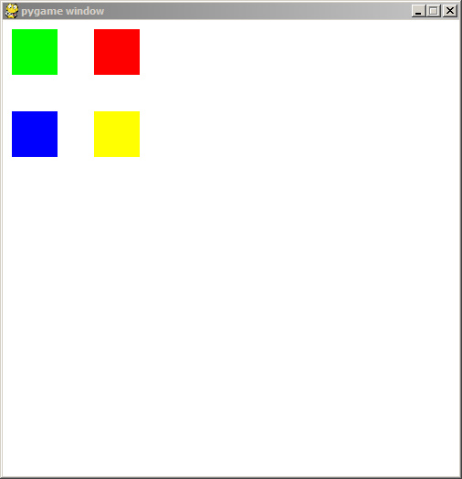

# hooman
~ pygame for humans

```
pip install hooman
```O
# demos


color change

```python
from hooman import Hooman

import pygame

hapi = Hooman(500, 500)

def handle_events(event):
    if event.type == pygame.QUIT:
        hapi.is_running = False

hapi.handle_events = handle_events

while hapi.is_running:
    hapi.background((255, 255, 255))

    hapi.no_stroke()
    mx = (hapi.mouseX() / hapi.WIDTH) * 255

    hapi.fill((0, mx, 0))
    for i in range(50 , 200, 60):
        hapi.rect(i, 50, 30, 30)

    hapi.fill((255, 0, 0))
    hapi.ellipse(hapi.mouseX(), hapi.mouseY(), 10, 10)

    hapi.stroke_size(1)
    hapi.stroke((255, 10, 10))
    hapi.line(0, hapi.mouseY(), hapi.mouseX()-10, hapi.mouseY())

    hapi.flip_display()
    hapi.event_loop()

pygame.quit()

```

lines


```python
from hooman import Hooman

import pygame

hapi = Hooman(500, 500)

def handle_events(event):
    if event.type == pygame.QUIT:
        hapi.is_running = False

hapi.handle_events = handle_events

while hapi.is_running:
    hapi.background((255, 255, 255))

    hapi.stroke_size(5)
    hapi.stroke((0, 255, 0))

    for i in range(0, hapi.WIDTH, 20):
        hapi.line(i, 0, hapi.mouseX(), hapi.mouseY())

    hapi.flip_display()
    hapi.event_loop()

pygame.quit()

```

squares



```python
from hooman import Hooman

import pygame

hapi = Hooman(500, 500)

def handle_events(event):
    if event.type == pygame.QUIT:
        hapi.is_running = False

hapi.handle_events = handle_events

size = 50
while hapi.is_running:
    hapi.background((255, 255, 255))

    hapi.no_stroke()
    hapi.fill((0, 255, 0))
    hapi.rect(10, 10, size, size)
    hapi.fill((255, 255, 0))
    hapi.rect(100, 100, size, size)
    hapi.fill((255, 0, 0))
    hapi.rect(100, 10, size, size)
    hapi.fill((0, 0, 255))
    hapi.rect(10, 100, size, size)

    hapi.flip_display()
    hapi.event_loop()

pygame.quit()

```

buttons


```python
from hooman import Hooman

import pygame

window_width, window_height = 500, 500
hapi = Hooman(window_width, window_height)

bg_col = (255, 255, 255)

#the function that gets called when the button is clicked on
def button_clicked(): 
    if button2.y == 250:
        button2.y = 300
    else:
        button2.y = 250


grey_style = {
    'background_color':(200, 200, 200),
    'hover_background_color':(220, 220, 220),
    'curve':0.1,
    'padding_x':5,
    'padding_y':5,
    'font_size':15
    }
button1 = hapi.button(150, 150, "Click Me",
    grey_style
)

buttonx = hapi.button(150, 10, "Click Me",
    grey_style
)

button2 = hapi.button(150, 250, "No Click Me",
    {
    'background_color':(200, 200, 200),
    'hover_background_color':(220, 220, 220),
    'outline':hapi.outline({
            'color':(200, 200, 200), 
            'amount':5
            }),
    'curve':0.3,
    'action':button_clicked,
    'padding_x':40,
    'padding_y':10,
    'font_size':15
    })

def handle_events(event):
    if event.type == pygame.QUIT:
        hapi.is_running = False
    if event.type == pygame.KEYDOWN:
        if event.key == pygame.K_ESCAPE:
            hapi.is_running = False


hapi.handle_events = handle_events

clock = pygame.time.Clock()

while hapi.is_running:
    hapi.background(bg_col)

    if button1.update(): #if the button was clicked
        bg_col = (255, 0, 0) if bg_col == (255, 255, 255) else (255, 255, 255)
    
    # for i in range(5):
    #     x = hapi.button(10+i*80, hapi.mouseY(), "Click Me",
    #         grey_style
    #     )
    # don't use it for ui elements in loop lile the above
    # each element can also be individually
    # updated
    hapi.update_ui() 
    hapi.event_loop()

    hapi.flip_display()

    clock.tick(60)

pygame.quit()

```

# Docs

## Colors, strokes & Fill

## .fill

- used for colouring next shapes
- `hapi.fill((100, 100, 100))` for r g b
- `hapi.fill(100)`  same as `hapi.fill((100, 100, 100))`

## .stroke

- used to set color of next shapes' outlines
- `hapi.stroke((100, 100, 100))` for r g b
- `hapi.stroke(100)`  same as `hapi.stroke((100, 100, 100))`

## .background

- used to set background color of screen
- `hapi.background((100, 100, 100))` for r g b
- `hapi.background(100)`  same as `hapi.background((100, 100, 100))`

## size

## .stroke_size

- used to control thickness of lines and outlines
- `hapi.stroke_size(size)` where size is an int

## .no_stroke

- set lines and outlines thickness to 0
- `hapi.no_stroke()`
- same as `hapi.stroke_size(0)`

## .font_size

- sets font size of text
- `hapi.font_size(12)`

# Ui

## .button

Create a button with `hapi.button(x, y, text, [optional paramters])`

- `x` - x location of the button
- `y` - y location of the button
- `text` - the text on the button
- `[optional parameters]` - a dictionary of any extra options you want for the button listed below

#### Optional Parameters

- surface - the surface you want the button on, by default it is the main window
- background - the color of the utton background
- hover_background_color - the color of the button background when the mouse is over the button
- font - the font of the text, by default it is Calibri
- font_size - the size of the text, by default it is 30
- font_colour - the colour of the text, by default it is black
- outline - this creates an outline for the button, must be a `hapi.outline()` object
- action - this is a function that gets called when the button is clicked
- action_arg - if the function given in action requires a parameter, you can use this to send to the function
- image - this should be a `pygame.Surface()` object that the button will show instead
- hover_image - this should be a `pygame.Surface()` object that the button will show when the mouse is over the button
- enlarge - this will resize the button when the mouse is over the button, this should be a bool
- enlarge_amount - this is the percentage that you want the button to resize to when the mouse is over the button (1 = no change)
- calculate_size - when set to True, this will calculate the width and height of the button from the size of the text
- padding_x - an integer that is added on to the width on both sides of the text when calculate_size is set to True
- padding_y - an integer that is added on to the height on both sides of the text when calulate_size is set to True
- dont_generate - when set to True, the button will not generate the images to put on screen, this can be handy if you want to use calculate_size without supplying text, you will need to call `button.update_text()` to generate the images before drawing
- curve - the amount of curve you want the button to have on the edges with 0 being no curve and 1 being full curve, by default it is 0

#### Methods

- update() - this updates the button and draws it on screen, this should be called every frame
- Update_text(text) - this changes the text and recreates the button
- get_rect() - this returns a pygame.Rect of the button
- width() - this returns the width of the button
- height() - this returns the height of the button

### Outline
create a outline for ui elements with `hapi.outline([optional parameters])`

- `[optional parameters]` - options for the outline

#### Optional paramters

- type - the type of outline, there is 'full' and 'half', by default it is 'full'
- amount - the thickness of the outline, by default it is 2
- color - the colour of the outline, by default it is black
